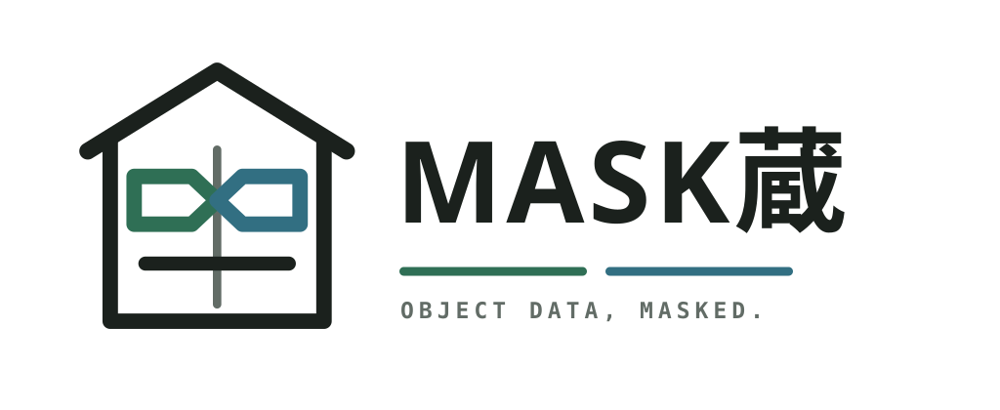
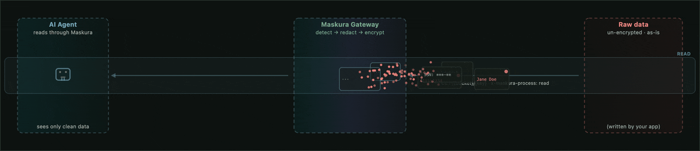
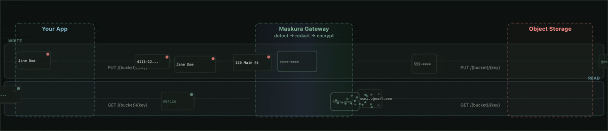

<p align="center">
  <picture>
    <source media="(prefers-color-scheme: dark)" srcset="docs/assets/maskura-lockup-dark.svg" />
    <source media="(prefers-color-scheme: light)" srcset="docs/assets/maskura-lockup-light.svg" />
    
  </picture>
</p>

# Maskura

<p align="center">
  <a href="https://github.com/231self/maskura/actions/workflows/ci.yml"></a>
  <a href="https://github.com/231self/maskura/actions/workflows/docs.yml"></a>
  <a href="https://github.com/231self/maskura/releases"></a>
  <a href="LICENSE"></a>
</p>

Maskura is a privacy boundary between agents and object data. Run it locally as an
S3-compatible endpoint backed by Docker storage, or put it in front of your existing
object store. It redacts or encrypts sensitive data on the way through, so agents get
the view you allow and the raw object never leaves your storage boundary.

**Read path** — agents see the view you allow; the raw object stays in storage.



**Write path** — protection is applied before the object reaches storage.



- **Pluggable pipeline** — plugins run in order; each can emit, drop, or reject. A tiny
  WIT interface (`begin` / `transform` / `finish`), pure byte-in/byte-out.
- **Sandboxed** — wasmtime, 64 MiB memory, fuel-limited, no host imports.
- **BYO plugins** — write in Rust (or any Wasm-capable language), wrap with
  `wasm-tools component`, `maskura plugin upload`. See [docs/plugins.md](docs/plugins.md).
- **Any S3-compatible storage** — Maskura is itself an S3-compatible endpoint for
  zero-dependency local Docker runs. Point it at MinIO, AWS S3, Google Cloud Storage,
  Backblaze B2, Cloudflare R2, or Vultr Object Storage when you want external storage —
  single or multi-cloud (consistent-hash ring, dual-write, read fail-over). MinIO is
  covered by the CI end-to-end suite;
  Backblaze B2 is tested against a real bucket (redaction and
  envelope-encryption round-trips).
- **Agent-safe reads** — read data through Maskura with `x-maskura-process: read`: the pipeline
  runs on the way *out*, so AI agents get redacted/encrypted output while the object
  at rest stays raw. No second cleaned copy to keep in sync.
- **Optional auth** — run with auth disabled locally, or enable API keys (in-memory,
  a JSON file, or Postgres).
- **Typed SDKs** — generated Python and TypeScript clients, published with every release.

Filters shipped in-tree (as examples to learn from): `noop`, `pii-default` (redact
emails / SSNs / credit cards), `email-detect`, `ssn-detect`, `card-detect`,
`envelope-encrypt` (per-field hybrid post-quantum encryption), `stable-encrypt`
(deterministic encryption).

## Contents

- [Quickstart](#quickstart)
- [Install the CLI (optional)](#install-the-cli-optional)
- [Run your own plugin](#run-your-own-plugin)
- [Usage examples](#usage-examples)
- [Demo](#demo)
- [How it works](#how-it-works)
- [Development](#development)
- [Security](#security)
- [Documentation](#documentation)
- [LLM agents](#llm-agents)
- [License](#license)

## Quickstart

No cloud account, database, MinIO service, or repo clone is needed. Run the
published Maskura gateway image with its own local S3-compatible API and one
durable Docker volume:

```bash
docker run --rm -p 127.0.0.1:8791:8080 -v maskura-local-keys:/data \
  -e AUTH_DISABLED=true \
  -e MASKURA_KEYS_FILE=/data/keys.json \
  -e MASKURA_STORAGE_MODE=local \
  -e MASKURA_LOCAL_STORAGE_DIR=/data \
  -e MASKURA_MULTIPART_MODE=staged \
  -e MASKURA_STREAMING_READ_MODE=passthrough \
  ghcr.io/231self/maskura/maskura:latest
# open http://localhost:8791 -> demo dashboard (no sign-up)
```

The gateway speaks SigV4, so your existing `aws s3` CLI works as-is:

```bash
export AWS_ACCESS_KEY_ID=demo AWS_SECRET_ACCESS_KEY=demo
printf '{"email":"jane@example.com","card":"4111111111111111"}\n' > data.jsonl

# Write through the pipeline; pii-default redacts on the way in:
aws s3 --endpoint-url http://localhost:8791 \
  cp data.jsonl s3://maskura-local/ingest/data.jsonl --content-type application/x-ndjson

# Read it back:
aws s3 --endpoint-url http://localhost:8791 cp s3://maskura-local/ingest/data.jsonl -
# → {"email":"[REDACTED_EMAIL]","card":"[REDACTED_CARD]"}
```

`curl` works too — `x-maskura-*` headers are the non-SigV4 alternative:

```bash
echo "jane.doe@example.com 4111111111111111" > data.txt
curl -X PUT http://localhost:8791/maskura-local/ingest/data.txt \
  -H "Content-Type: text/plain" --data-binary @data.txt
curl http://localhost:8791/maskura-local/ingest/data.txt
# → [REDACTED_EMAIL] [REDACTED_CARD]
```

We map the container's `8080` to `8791` on your host so it doesn't collide with
anything you already run. The dashboard's copy-paste snippets use whatever
`host:port` you opened, so they just work.

## Install the CLI (optional)

Prefer the CLI? Install it with `cargo install`, or grab a prebuilt Linux
(amd64/arm64) or native Apple Silicon binary attached to each
[GitHub Release](https://github.com/231self/maskura/releases):

```bash
cargo install --git https://github.com/231self/maskura --bin maskura
maskura local init                  # runs the published gateway image (Docker)
maskura plugin list                 # the pii-default plugin is preloaded

# A sample file to push through the pipeline:
echo "jane.doe@example.com 4111111111111111" > data.csv

# Write data through the pipeline; it is transformed before it reaches storage
maskura put ./data.csv ingest/data.csv --bucket maskura-local

# Read it back
maskura get ingest/data.csv --bucket maskura-local

# For recoverable PII, create a hybrid key with the API key and keep the
# private key locally. New encrypted objects can then be decrypted on read.
maskura key create --label recoverable --generate-encryption-key \
  --private-key-out ./maskura-private-key.pem
maskura get ingest/data.csv --bucket maskura-local \
  --decrypt ./maskura-private-key.pem
```

`maskura local init` pulls the gateway image tagged with the CLI version
(`ghcr.io/231self/maskura/maskura:v0.5.3` for `maskura` 0.5.3; CLI and gateway always
match, never `:latest`) and runs a durable single-node local FileStore
(`AUTH_DISABLED=true`, staged multipart enabled, all state on one volume). It picks
a free port (8080+) and only listens on localhost. `maskura local down` stops it.
Use `just dev-up` when you specifically need the MinIO-backed cloud-storage path.

### Standalone durable local storage

The gateway can persist objects and restart-safe multipart state directly to a
mounted filesystem volume without MinIO, Postgres, or cloud credentials. This is
a single-node S3-compatible deployment. The same volume contains objects, API
keys, encrypted multipart artifacts, event logs, commit proofs, and the local
wrapping key.

```bash
docker run --rm -p 8080:8080 -v maskura-data:/data \
  -e AUTH_DISABLED=true \
  -e MASKURA_STORAGE_MODE=local \
  -e MASKURA_LOCAL_STORAGE_DIR=/data \
  -e MASKURA_MULTIPART_MODE=staged \
  ghcr.io/231self/maskura/maskura:latest
```

With `AUTH_DISABLED=true`, clients can use any non-empty placeholder credentials;
the quickstart uses `demo`. The gateway never prints generated key secrets to its
logs. Objects, local API keys, and in-progress staged
multipart uploads survive container restarts through the mounted volume. Keep
the `.maskura/wrapping.key` file with the volume backup; losing it makes
encrypted incomplete uploads unrecoverable.

## Run your own plugin

```bash
# 1. Write a filter in Rust or any Wasm component-capable language
# 2. Build it:
cargo build --release --target wasm32-unknown-unknown
wasm-tools component new target/wasm32-unknown-unknown/release/my_filter.wasm \
  -o my-filter.component.wasm
# 3. Upload and enable it:
maskura plugin upload my-filter.component.wasm
maskura plugin enable <id>
# 4. Reorder the pipeline — output of one feeds the next:
maskura plugin reorder pii-default my-filter
```

Full guide: [docs/plugins.md](docs/plugins.md).

Typed binary codecs use a separate schema-aware reductor contract, not the
byte-oriented plugin pipeline. See [docs/binary-adapters.md](docs/binary-adapters.md)
when adding a custom logical-type adapter.

Opt-in Avro OCF processing (`MASKURA_ENABLE_AVRO=true`) and its supported subset are
documented in [docs/avro.md](docs/avro.md). A runnable PUT/read example is in
[examples/avro-demo.py](examples/avro-demo.py).

The local stdio MCP server exposes put, get, list, and delete tools to agent
clients while preserving the gateway's normal auth, pipeline, and metering path.
See [docs/mcp.md](docs/mcp.md) for Claude Desktop, Cursor, and Kilo setup, plus
the runnable [`examples/mcp-client.py`](examples/mcp-client.py) lifecycle.

## Usage examples

Everything below is copy-paste runnable.

**Redaction — PII filtered on write**

```bash
# Local gateway (Maskura-managed Docker container, durable FileStore):
maskura local init
maskura put ./data.csv ingest/data.csv --bucket maskura-local
maskura get ingest/data.csv --bucket maskura-local     # emails/SSNs/cards redacted

# Optional external-backend validation path (MinIO + Docker Compose):
just dev-up
maskura put ./data.csv ingest/data.csv --bucket maskura-local

# End-to-end validation:
just e2e                # see docs/e2e.md for the feature-by-feature breakdown
```

**Agent-safe reads — raw at rest, scrubbed on the way out**

```bash
# Data at rest stays raw (your app owns the originals).
maskura put ./customers.json customers/c1.json --bucket maskura-local

# Transformed reads are deliberately opt-in. Unsafe component snapshots are
# staged encrypted before any response bytes are disclosed.
export MASKURA_STREAMING_READ_MODE=transformed
export MASKURA_TRANSFORMED_READ_SPOOL=encrypted
# Set this to the SHA-256 component digests reviewed for prefix-safe disclosure.
# Imported components are unsafe unless listed here.
export MASKURA_PREFIX_SAFE_COMPONENT_HASHES=<comma-separated-component-sha256-digests>

# An AI agent reads through Maskura: PII is redacted before the agent sees it.
curl -H "x-maskura-process: read" http://localhost:8080/customers/c1.json
# → {"email":"[REDACTED_EMAIL]","card":"[REDACTED_CARD]","note":"hi"}

# Same object, no header: the raw bytes your app owns.
curl http://localhost:8080/customers/c1.json
# → {"email":"alice@example.com","card":"4111111111111111","note":"hi"}
```

One source of truth, two projections: the app gets full fidelity, the agent
gets only what you allow. Transformed reads require stored, version-bound
metadata and work with S3, managed storage, and in-memory backends. Presigned
backend URLs remain raw-only because they cannot provide a safe metadata
preflight.

Transformed reads reject `Range`, `partNumber`, non-identity source encodings,
unknown mandatory formats, and `HEAD`. They never fall back to raw bytes.
`MASKURA_STREAMING_READ_MODE=off` (the default) rejects transformed reads;
`passthrough` enables only raw streaming. `transformed` enables this path.
Without `MASKURA_TRANSFORMED_READ_SPOOL=encrypted`, a snapshot containing any
component not listed in `MASKURA_PREFIX_SAFE_COMPONENT_HASHES` is rejected before
its source body is consumed. Set `MASKURA_SPOOL_DIR`, `MASKURA_SPOOL_MAX_OBJECT_BYTES`,
and `MASKURA_SPOOL_QUOTA_BYTES` to a private, capacity-reserved volume; the quota
must cover encrypted framing overhead as well as plaintext output.

**Encryption — per-field envelope encryption, decryptable only by you**

```bash
# Round-trip against any S3-compatible bucket: pre-encrypt fixture →
# encrypted bytes fetched straight from the bucket → decrypted through Maskura:
export B2_S3_ENDPOINT=https://s3.us-east-005.backblazeb2.com
export B2_REGION=us-east-005
export B2_BUCKET=your-bucket
export B2_ACCESS_KEY_ID=your-key-id
export B2_SECRET_ACCESS_KEY=your-application-key
bash examples/b2-encrypt-demo.sh
```

New writes use hybrid X25519 + ML-KEM-768 key encapsulation with AES-256-GCM.
The CLI and the Python and TypeScript high-level clients generate compatible
hybrid keypairs, attach only the public key, and decrypt locally with the
client-held private key. Legacy RSA envelopes remain readable through explicit
SDK compatibility helpers. See [Encryption](docs/encryption.md#client-tooling-status).

**Plugins — bring your own transform**

```bash
maskura plugin list                              # pipeline order
maskura plugin upload my-filter.component.wasm   # runtime import, no rebuild
maskura plugin enable <id>
maskura plugin reorder pii-default my-filter     # output of one feeds the next
```

**SDKs — Python**

```python
import os

from maskura_client import MaskuraClient

client = MaskuraClient(
    "http://localhost:8080",
    os.environ["MASKURA_ACCESS_KEY"],
    os.environ["MASKURA_SECRET_KEY"],
)
priv, pub = client.generate_keypair()                  # X25519 + ML-KEM-768
client.attach_public_key(pub)                          # bind to your API key
client.put_object("bucket", "key", b"jane@example.com 4111111111111111")
blob = client.get_object("bucket", "key")
assert "jane@example.com" not in blob.decode()          # stored encrypted
print(client.decrypt_payload(blob, priv))              # you hold the key
```

Full details: [examples/README.md](examples/README.md) and
[docs/plugins.md](docs/plugins.md).

## Demo


The same PII file, three ways — raw, redacted, and deterministic-encrypted — pushed
through `aws s3` pointed at Maskura. [Watch the interactive demo (pause, scrub, speed) →](https://231self.github.io/maskura/demo.html)

## How it works

```
S3 SDK / CLI / tool ──▶ Maskura Gateway (Wasm plugin pipeline) ──▶ storage
                            │
                            ├─ filter  → redact emails, SSNs, credit cards
                            ├─ encrypt → per-field envelope / deterministic encryption
                            └─ ...     → your plugins, in order
```

## Development

```bash
just check          # fmt + clippy + build filters + tests
just pre-push       # check + Rust/Python/npm advisories + dependency policy
just push           # run pre-push, then publish the current jj bookmark
just e2e            # end-to-end against MinIO (Docker)
just build-sdks     # regenerate Python/TypeScript SDKs from the OpenAPI spec
```

`just pre-push` is the local trust gate: it mirrors the dependency-security
checks that would otherwise first appear in GitHub, and verifies that Actions
and Docker base images remain pinned to immutable revisions. It requires
`cargo-audit`, `cargo-deny`, `uvx`, and `npm`. Dependabot still handles scheduled
update discovery; the local gate blocks known vulnerable dependencies before a
push.

### Run CI/release locally (no GitHub minutes)

Two local pipeline runners, both with persistent caches:

- **`just ci-local`** — runs the real `.github/workflows/ci.yml` via
  [act](https://github.com/nektos/act) (local Docker; `actions/cache` backed by act's
  cache server, so cargo deps are reused across runs).
- **`just build-local` / `just image-local` / `just publish-local TAG=x`** — dagger
  pipeline (`dagger/main.py`) with cargo registry + target dirs on persistent cache
  volumes; `publish-local` pushes the image to
  `ghcr.io/231self/maskura/maskura` (needs `docker login ghcr.io` once).

See `CONTRIBUTING.md`.

## Security

Maskura transforms sensitive data before it reaches storage and applies strict,
fail-closed guarantees on the streaming data plane. See
[docs/security.md](docs/security.md) for the full model — what's guaranteed and
what's on you.

Found a vulnerability? Report it **privately** — via
[Maskura private vulnerability reporting](https://github.com/231self/maskura/security/advisories/new)
or security@231self.com — and never through a
[public issue](https://github.com/231self/maskura/issues/new/choose). See
[SECURITY.md](SECURITY.md) for the supported-version policy,
response timeline, and what to include in a report.

CI runs RustSec and dependency-policy audits, dependency-diff review, and
CodeQL for Rust, Python, TypeScript/JavaScript, and workflow code. External
Actions are pinned to immutable commits. Releases include `SHA256SUMS`, an SPDX
JSON SBOM, and GitHub build-provenance attestations for downloadable artifacts
and published container manifests. This includes the native
`maskura-macos-arm64` and `maskura-mcp-macos-arm64` Apple Silicon builds. Verify
a downloaded artifact with:

```bash
sha256sum --check SHA256SUMS --ignore-missing
gh attestation verify --repo 231self/maskura ./maskura-linux-amd64
```

## Documentation

- **Docs site** — the same docs, rendered:
  <https://231self.github.io/maskura/>.
- `examples/` — runnable end-to-end demos (B2 encryption round-trip).
- `docs/plugins.md` — create and consume your own plugins.
- `docs/security.md` — the security model of the gateway.
- `docs/adr/` — architecture decision records.
- `AGENTS.md` — development conventions.
- `CONTRIBUTING.md` — contribution guide, tests, and author identity policy.
- `OWNERS.md` — maintainers and decision process.

## LLM agents

Coding agents (Claude Code, Kilo, Cursor, …) read `AGENTS.md` from the repo root
automatically. For project-specific Maskura context, install the bundled skill:

```bash
# Claude Code (user-global):
mkdir -p ~/.claude/skills && ln -s "$(pwd)/skills/maskura" ~/.claude/skills/maskura
# Kilo (user-global):
mkdir -p ~/.kilo/skills && ln -s "$(pwd)/skills/maskura" ~/.kilo/skills/maskura
```

The skill teaches agents what Maskura is, the plugin pipeline, build/test/run commands,
crate layout, and the CI/release gotchas (BuildKit cache mounts, act/colima,
multi-arch builds).

## License

Apache-2.0. See `LICENSE`.
